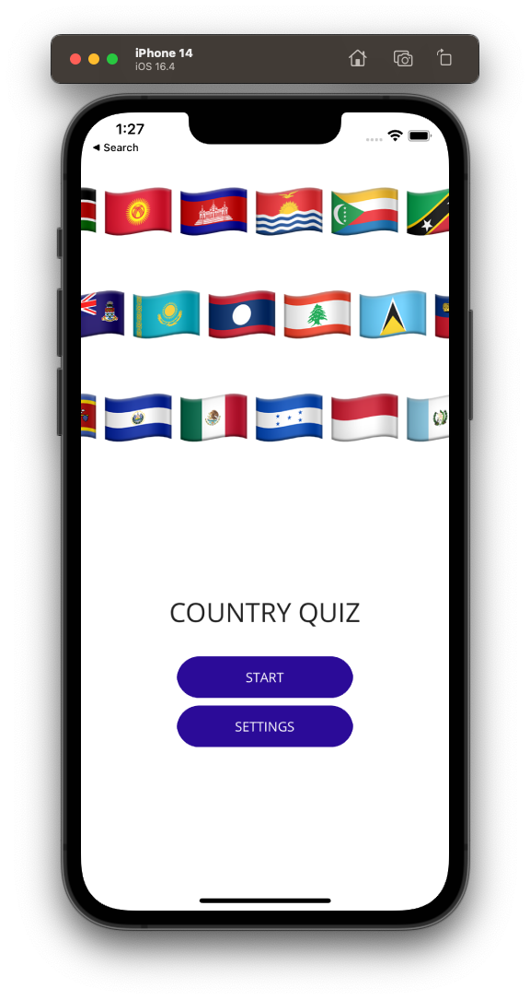
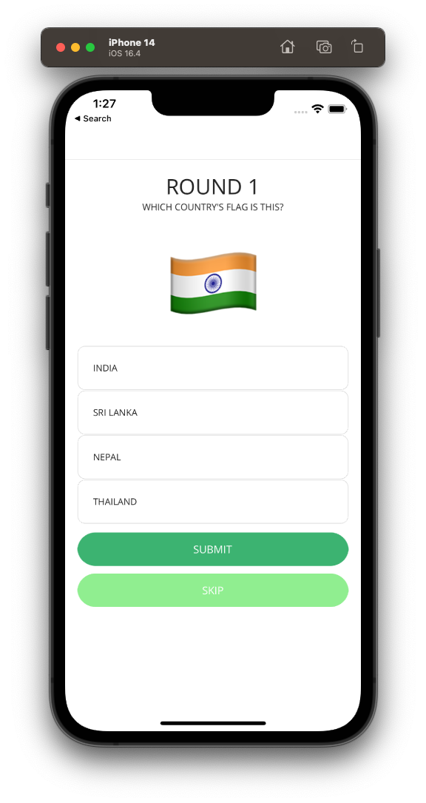
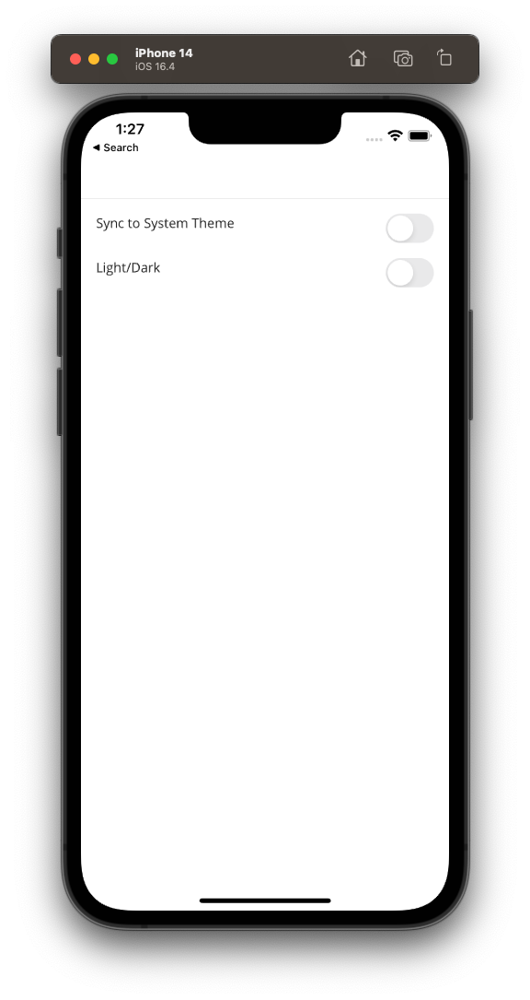

# maui-country-quiz

A quiz app to learn .NET MAUI Development.

## Features

- Get Country Data from a public Graph QL API
- Basic animation for fun
- Quiz about countries' capitals, flags and continents
- Theme support (dark/light)
- Demonstration of clean architecture and splitting of various sharable code

## Screenshots

Home Page | Quiz | Settings
--- | --- | ---
 |  | 
